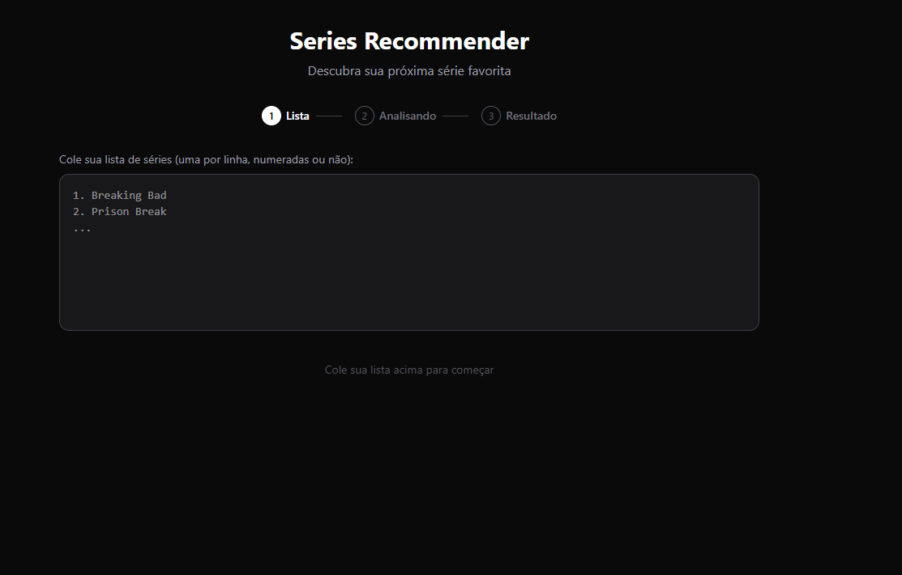
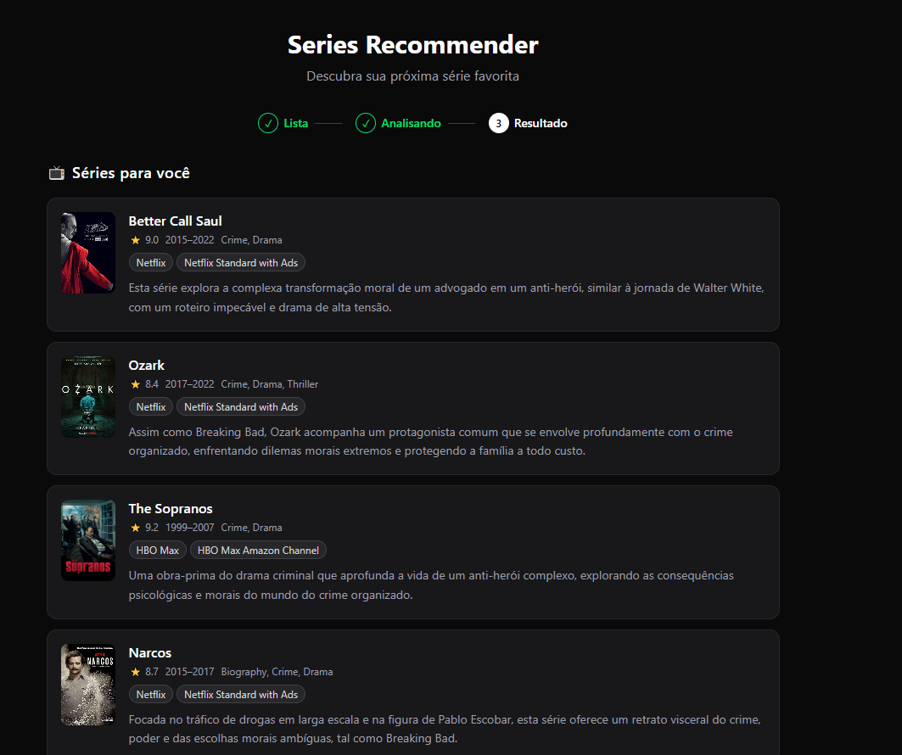

# Series Recommender

Descubra sua próxima série ou filme favorito com base no que você já assistiu.

Cole sua lista, marque seus favoritos e receba 5 sugestões de séries + 5 filmes personalizados — com poster, avaliação e onde assistir no Brasil.

## Screenshots





## Funcionalidades

- **Seleção opcional de favoritos** — marque até 10 séries que mais gostou para afinar as recomendações
- **5 séries + 5 filmes** recomendados por IA com base no seu gosto
- **Poster e metadados** de cada recomendação via OMDb (rating, ano, gêneros)
- **Disponibilidade em streaming no Brasil** via JustWatch (Netflix, HBO Max, Apple TV, etc.)
- **Página personalizada** (`/vitor`) com lista pré-carregada

## Stack

- [Next.js 16](https://nextjs.org/) — App Router + Server Actions
- [Tailwind CSS](https://tailwindcss.com/) — estilização
- [Google Gemini 2.5 Flash](https://ai.google.dev/) — geração de recomendações por IA
- [OMDb API](https://www.omdbapi.com/) — dados de séries e filmes (poster, rating, gênero)
- [JustWatch GraphQL API](https://www.justwatch.com/) — disponibilidade em streaming no Brasil

## Como usar

1. Cole sua lista de séries (numeradas ou não, uma por linha)
2. Marque seus favoritos entre os já assistidos *(opcional, até 10)*
3. Clique em **Ver recomendações** e aguarde alguns segundos
4. Receba 5 séries e 5 filmes personalizados com onde assistir no Brasil

## Setup local

### Pré-requisitos

- Node.js 18+
- Chave da [OMDb API](https://www.omdbapi.com/apikey.aspx) (gratuita)
- Chave da [Google Gemini API](https://aistudio.google.com/) (gratuita)

### Instalação

```bash
git clone https://github.com/vitorcoelhof/series-recommender.git
cd series-recommender
npm install
```

### Variáveis de ambiente

Crie um arquivo `.env.local` na raiz do projeto:

```env
OMDB_API_KEY=sua_chave_aqui
GEMINI_API_KEY=sua_chave_aqui
```

### Rodando localmente

```bash
npm run dev
```

Acesse [http://localhost:3000](http://localhost:3000)

## Deploy

O projeto está configurado para deploy na [Vercel](https://vercel.com/). Após conectar o repositório, adicione as variáveis de ambiente `OMDB_API_KEY` e `GEMINI_API_KEY` em **Settings → Environment Variables**.

## Testes

```bash
npm test
```
